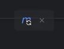

# 构建与 CICD 相结合的最佳实践测试自动化流程：第一部分 - 创建 Spring Boot REST API

作者/译者: [Rob McBryde](https://medium.com/@robert_mcbryde?source=post_page---byline--5ada5c18a4b8---------------------------------------)/溜的一比

文章来源: Mediam

文章地址: https://medium.com/@robert_mcbryde/building-a-best-practice-test-automation-pipeline-with-ci-cd-part-1-creating-a-spring-boot-rest-5ada5c18a4b8

​​

## 介绍

在上一篇文章中，我们介绍了使用 CI/CD 的测试自动化流程的概念。现在，让我们开始创建我们应用的基础：一个 Spring Boot REST API。虽然任何后端技术都可以满足我们的需求，但 Spring Boot 提供了一个强大且文档齐全的框架，非常适合演示最佳实践。

在本教程结束时，你将拥有：

* 一个带有简单“Hello World”端点的运行中的 Spring Boot REST API
* 单元和 API 测试以确保质量
* 使用 Docker 容器化应用

让我们开始吧！

## 先决条件

* 安装了 Java 17
* 安装了 Maven
* 安装了 Git
* 安装了 Docker

我计划不涵盖上述先决条件的安装指南，因为网上有很多很好的资源可以做到这一点，但如果你遇到任何问题，请随时联系我，我很乐意提供帮助。

## 第一部分：创建 Spring Boot 应用

### 使用 Spring Initializr

1. 在你的网络浏览器中打开 [Spring Initializr](https://start.spring.io/)。
2. 使用以下设置配置你的项目：

    * 项目：Maven
    * 语言：Java
    * Spring Boot：最新稳定版本（撰写本文时为 3.4.x）
    * 项目元数据：

      * 组：com.example.automationdemo
      * artifact：automation-demo
      * 名称：automation-demo
      * 描述：用于 CI/CD 流水线的演示 REST API
      * 包名：com.example.automationdemo.automation-demo
      * 打包：Jar
      * Java：17
3. 添加以下依赖项：

    * Spring Web
    * Spring Boot DevTools
    * Spring Boot Actuator
4. 点击“生成”下载项目 ZIP 文件。
5. 将 ZIP 文件解压到你选择的位置，并用你选择的 IDE 打开。我正在使用 JetBrains 的 IntelliJ。

### 创建一个简单的 REST 控制器

让我们添加一个简单的 REST 控制器来处理我们的“Hello World”端点：

```java
package com.example.automationdemo.automation_demo.controller;

import org.springframework.web.bind.annotation.GetMapping;
import org.springframework.web.bind.annotation.RequestMapping;
import org.springframework.web.bind.annotation.RestController;

@RestController
@RequestMapping("/api")
public class HelloController {

    @GetMapping("/hello")
    public String hello() {
        return "Hello, World!";
    }
}
```

在以下路径创建一个名为“controller”的新目录，并创建名为 HelloController.java 的文件：`src/main/java/com/example/automationdemo/automation_demo/controller/HelloController.java`​。

在构建软件时，DevOps 教会我们要经常做困难的事情。即使我们现在只有一个简单的 Spring Boot“Hello, World!”REST API，我们的目标是通过 GitHub CI/CD 流水线将其部署到 Google Cloud Platform (GCP)。通过尽早设置部署流水线，我们最大化了学习机会，并确保我们的系统设计从一开始就与流水线友好。一旦我们在本篇博文中完成了本地运行的 API 服务，我们将在下一篇博文中通过 GitHub 的 CI/CD 流水线将其部署到 GCP。

一个至关重要的第一步是编写单元测试——即使它们目前很基础。这些测试不仅验证我们的 API，还服务于更大的目的：它们允许我们完善和压力测试我们的 CI/CD 流水线。随着系统的演变，我们将重构这些测试以使其更符合领域需求，但目前它们在确保我们能够可靠地构建、测试和部署方面提供了巨大的价值。让我们开始吧。🚀

### 单元测试控制器

现在，让我们为我们的控制器创建一个单元测试：

```java
package com.example.automationdemo.automation_demo.controller;

import static org.hamcrest.Matchers.equalTo;
import static org.springframework.test.web.servlet.result.MockMvcResultMatchers.content;
import static org.springframework.test.web.servlet.result.MockMvcResultMatchers.status;

import org.junit.jupiter.api.Test;
import org.springframework.beans.factory.annotation.Autowired;
import org.springframework.boot.test.autoconfigure.web.servlet.WebMvcTest;
import org.springframework.http.MediaType;
import org.springframework.test.web.servlet.MockMvc;
import org.springframework.test.web.servlet.request.MockMvcRequestBuilders;

@WebMvcTest(HelloController.class)
public class HelloControllerTest {

    @Autowired
    private MockMvc mvc;

    @Test
    public void getHello() throws Exception {
        mvc.perform(MockMvcRequestBuilders.get("/api/hello")
                .accept(MediaType.APPLICATION_JSON))
                .andExpect(status().isOk())
                .andExpect(content().string(equalTo("Hello, World!")));
    }
}
```

在 `src/test/java/com/example/automationdemo/automation_demo/controller/`​ 中创建这个名为“HelloControllerTest”的文件。

我们可以通过 Maven 在终端中运行单元测试，使用命令 `./mvnw test`​ 来确保它们正常工作。它们目前验证了当我们访问 `/api/hello`​ 时，我们收到了一个包含字符串“Hello, World!”的 200 响应。

我们目前通过 `WebMvcTest`​ 装饰器实现了这一点。与加载整个应用上下文的 `SpringBootTest`​ 装饰器不同，`WebMvcTest`​ 只加载 Web 层。这包括我们正在测试的控制器。Spring 的依赖注入自动将 `MockMvc`​ 实例注入到我们的测试中，提供了一种强大的方法来测试 MVC 控制器，而无需启动完整的 HTTP 服务器。随着我们开始围绕更复杂的业务逻辑添加更多单元测试，这些业务逻辑需要模拟更多数据，我们将在未来的博文中详细介绍。

### 本地运行

此时，我们已经能够在本地运行并单元测试我们的 REST API 端点。

Spring Boot 的一个巨大优势是它带有一个嵌入式应用服务器，允许我们在本地运行我们的服务，而无需进行大量设置。由于 Spring Boot 产生一个自包含的单元——将我们的应用代码与内置服务器（如 Tomcat、Jetty 或 Undertow）结合在一起——我们不需要安装或配置外部服务器即可开始。这意味着我们可以通过一个简单的命令立即执行我们的服务，使本地开发和测试快速且无缝。这种自给自足是 Spring Boot 在微服务和云原生应用中如此受欢迎的关键原因，因为它简化了部署并减少了运营开销。

由于我们使用了 Spring Initializr，我们的项目中已经安装了 mvnw。Spring Boot 包含的 mvnw（Maven 包装器）允许我们在不需要单独 Maven 安装的情况下运行 Maven 命令，确保在不同环境中进行一致的构建。

要在本地打包、测试和运行我们的应用，请确保你在项目的根目录中，并在终端中运行以下命令（我正在使用 Mac）：

```bash
./mvnw package
./mvnw spring-boot:run
```

​`package`​ 命令将为我们的应用制作 JAR 文件，该文件创建在 target 子目录中。作为过程的一部分，它会自动找到并运行我们的单元测试。

​`spring-boot:run`​ 启动我们的本地应用服务器，你可以在你喜欢的网络浏览器中访问 `http://localhost:8080/api/hello`​。

## 本地运行 Spring Boot

本地运行非常适合开发工作，但让我们回到正轨，通过 CI/CD 流水线将此 API 投入生产。接下来是一些静态代码质量检查。

## 第二部分：添加代码质量工具

### 配置 Maven 用于代码检查

让我们将 CheckStyle 插件添加到我们的 `pom.xml`​ 中，用于代码检查。将以下内容添加到你的 `<build>`​ 部分：

```xml
<plugin>
    <groupId>org.apache.maven.plugins</groupId>
    <artifactId>maven-checkstyle-plugin</artifactId>
    <version>3.3.0</version>
    <configuration>
        <configLocation>google_checks.xml</configLocation>
        <consoleOutput>true</consoleOutput>
        <failsOnError>true</failsOnError>
        <linkXRef>false</linkXRef>
    </configuration>
    <executions>
        <execution>
            <id>validate</id>
            <phase>validate</phase>
            <goals>
                <goal>check</goal>
            </goals>
        </execution>
    </executions>
</plugin>
```

每次你对 `pom.xml`​ 文件进行更改时，确保同步更改以允许 Maven 将依赖项拉入你的项目。在 IntelliJ 中，可以通过同步更改按钮来完成。

​​

### `maven-checkstyle-plugin`​ 在 Spring Boot 项目中的作用

​`maven-checkstyle-plugin`​ 是一个静态代码分析工具，有助于在 Maven 项目中强制执行编码标准。它集成了 Checkstyle，后者根据预定义或自定义规则（例如 Google Java 风格）扫描 Java 源文件中的风格违规。

在 Spring Boot 项目中，它可以：

* 确保代码一致性——在团队中强制执行风格规则。
* 提高代码质量——尽早发现格式问题（例如命名约定、缩进、Javadoc 合规性）。
* 在违规时使构建失败——如果配置严格，它会阻止合并不符合标准的代码。

它在验证阶段运行 Checkstyle，你可以使用自定义的 checkstyle.xml 配置来为你的团队定制规则。这是最佳实践，因为它有助于维护代码的一致性和质量，特别是在大型项目中。

在软件的各个方面，都有替代方案可供选择，例如 Prettier 更依赖基于 IDE 的格式化。再一次，我纯粹是在介绍将自动代码质量工具添加到你的项目中的最佳实践原则。使用哪种代码检查工具由你决定！

你可以在终端中通过 `./mvnw checkstyle:check`​ 在本地运行上述 checkstyle。再次强调，我们将在部署 Spring 服务到生产环境时作为 CI/CD 流水线的一部分运行此命令。

### Spring Boot Actuator：健康和信息端点

Spring Boot Actuator 是一个强大的工具，提供生产就绪的功能来监控和管理应用。它公开了各种内置端点，提供了对应用健康状况、配置和运行时行为的洞察。在这些端点中，`/health`​ 和 `/info`​ 端点对于评估服务状态和提供相关元数据特别有用。

为了使这两个端点可用，你需要在 `application.properties`​ 文件中添加以下行，该文件位于 `src/main/resources/application.properties`​。

```properties
management.endpoints.web.exposure.include=health,info
```

### `/health`​ 端点

​`/health`​ 端点对于监控 Spring Boot 应用的可用性至关重要。它返回有关应用当前状态的信息，可以像“status”: “UP”一样简单，也可以更详细，包括数据库连接、磁盘空间和外部服务状态。这在与 Kubernetes 等容器编排器集成时特别有用，后者依赖健康检查进行服务管理。

默认情况下，`/health`​ 提供基本状态，但你可以配置它以公开更多详细信息。目前默认设置对我们来说是完美的。当你的服务在本地运行时，你可以在浏览器中访问 `http://localhost:8080/actuator/health`​ 来查看 `/health`​ 端点的实际运行情况。

### `/info`​ 端点

​`/info`​ 端点用于公开任意的应用元数据，如版本号、构建信息或环境详细信息。默认情况下，它返回一个空的 JSON 对象，但你可以在 `application.properties`​ 中输入以下内容来填充它：

```properties
info.app.name=Automation Demo App
info.app.description=An example Spring Boot Rest API application to demonstrate testing via a modern CI/CD pipeline.
info.app.version=1.0.0
info.app.java.version=${java.version}
info.app.spring-boot.version=${spring-boot.version}
```

当你的服务在本地运行时，你可以在浏览器中访问 `http://localhost:8080/actuator/info`​ 来查看 `/info`​ 端点的实际运行情况。

### 添加 API 测试

让我们使用 RestAssured 创建一个 API 测试。首先，将依赖项添加到你的 `pom.xml`​ 中，并记得在完成后同步 Maven。

```xml
<dependency>
    <groupId>io.rest-assured</groupId>
    <artifactId>rest-assured</artifactId>
    <scope>test</scope>
</dependency>
```

### 什么是 RestAssured？

RestAssured 是一个用于测试 RESTful API 的 Java 库。它简化了发送 HTTP 请求和验证响应的过程，使其成为 Spring Boot 应用中 API 端点集成测试的绝佳选择。

### 为什么在 Spring Boot API 测试中使用 RestAssured？

* 流畅 API：提供 DSL 风格的语法来编写表达性测试。
* 内置断言：轻松验证响应状态、正文、标头等。
* 无缝集成：与 JUnit 和 Spring Boot 测试框架配合良好。
* 支持 JSON 和 XML：简化请求和响应处理。

### 创建我们的第一个 API 测试类

```java
package com.example.automationdemo.automation_demo;

import static io.restassured.RestAssured.*;
import static io.restassured.specification.ProxySpecification.port;
import static org.hamcrest.Matchers.*;

import org.junit.jupiter.api.BeforeEach;
import org.junit.jupiter.api.Test;
import org.springframework.boot.test.context.SpringBootTest;
import org.springframework.boot.test.web.server.LocalServerPort;

@SpringBootTest(webEnvironment = SpringBootTest.WebEnvironment.RANDOM_PORT)
public class HelloApiTest {

    @LocalServerPort
    private int port;

    @BeforeEach
    public void setUp() {
        baseURI = "http://localhost";
        port(port);
    }

    @Test
    public void testHelloEndpoint() {
        given()
                .when()
                .get("/api/hello")
                .then()
                .statusCode(200)
                .body(equalTo("Hello, World!"));
    }
}
```

在 `src/test/java/com/example/automationdemo/automation_demo/`​ 中创建这个名为“HelloApiTest”的文件。

让我们更详细地讨论运行 API 测试。API 测试与单元测试在如何与运行中的应用交互方面有所不同，因为它们测试整个系统，而不是单独的组件。

API 测试需要一个运行中的应用实例（或至少是它的测试实例），而单元测试则在隔离环境中运行，无需启动整个应用。

在运行 API 测试时，你可以采用几种不同的方法，我将解释本地测试和容器化选项。（剧透警告：我建议将你的应用容器化。）

### 选项 1：本地运行 API 测试

我们使用 RestAssured 创建的 API 测试（HelloApiTest 类）设计为与运行中的 Spring Boot 应用实例一起工作。以下是你如何在本地运行它们的方法：

#### 使用 Maven 的测试阶段直接运行

当你用 Maven 运行这种类型的测试时，Spring Boot 的测试框架会自动：

* 在随机端口上启动你的应用（`@SpringBootTest(webEnvironment = SpringBootTest.WebEnvironment.RANDOM_PORT)`​）
* 将该端口注入到你的测试中（`@LocalServerPort private int port;`​）
* 针对运行中的应用运行你的测试
* 在测试完成后关闭应用

要运行这些测试：

```bash
./mvnw test -Dtest=HelloApiTest
```

你不需要手动启动应用或将其容器化——测试框架会为你处理这些。

然而，对于现实世界的应用，我个人建议使用 Docker 将你的应用容器化。为此，我们将使用 Testcontainers。

### 选项 2：为 Spring Boot API 测试实现 Testcontainers

Testcontainers 是一个第三方库，它将在测试期间自动管理我们的 Docker 容器。首先，我们必须将这些依赖项添加到我们的 `pom.xml`​ 中：

```xml
<dependency>
    <groupId>org.testcontainers</groupId>
    <artifactId>testcontainers</artifactId>
    <version>1.19.3</version>
    <scope>test</scope>
</dependency>
<dependency>
    <groupId>org.testcontainers</groupId>
    <artifactId>junit-jupiter</artifactId>
    <version>1.19.3</version>
    <scope>test</scope>
</dependency>
```

替换为 TestContainer 版本的 HelloApiTest API 测试：

```java
package com.example.automationdemo.automation_demo;

import static io.restassured.RestAssured.*;
import static org.hamcrest.Matchers.*;

import org.junit.jupiter.api.BeforeEach;
import org.junit.jupiter.api.Test;
import org.testcontainers.containers.GenericContainer;

import org.testcontainers.junit.jupiter.Container;
import org.testcontainers.junit.jupiter.Testcontainers;


@Testcontainers
public class HelloApiContainerIT {
  
    // 检索预构建镜像以用于我们的测试
    @Container
    public static GenericContainer<?> container = new GenericContainer<>("demo-api:latest")
            .withExposedPorts(8080);

    @BeforeEach
    public void setUp() {
        baseURI = "http://localhost";
        port = container.getMappedPort(8080);
        System.out.println("Container started at port: " + port);
    }

    @Test
    public void testHelloEndpoint() {
        given()
                .when()
                .get("/api/hello")
                .then()
                .statusCode(200)
                .body(equalTo("Hello, World!"));
    }

    @Test
    public void testHealthEndpoint() {
        given()
                .when()
                .get("/actuator/health")
                .then()
                .statusCode(200)
                .body("status", equalTo("UP"));
    }
}
```

在 `src/test/java/com/example/automationdemo/automation_demo/`​ 中创建这个名为 HelloApiContainerIT.java 的文件，确保你不再有上一步的 HelloApiTest。IT 代表集成测试，这是我们通过 maven 配置文件区分测试阶段并允许我们通过 CI/CD 流水线或本地运行的重要命名约定。

### 通过 Docker 容器化我们的应用

Docker 本身是一个完整的话题，我不会在这篇文章中深入探讨，因为网上有很多很棒的免费资源可以让你了解更多。在我看来，这是现代软件工程中一个相当标准的做法。

Dockerfile 是一个脚本，包含一组用于构建 Docker 镜像的指令，Docker 镜像是一个轻量级、便携且自给自足的包，包含运行应用所需的一切。在我们的 Spring Boot 应用的背景下，Dockerfile 允许我们容器化我们的服务，将 Java 运行时、依赖项和应用代码捆绑到一个可部署单元中。这确保了从本地开发到生产的环境一致性。通过定义一个基础镜像（例如，用于 Java 17 的 Eclipse Temurin），复制应用 JAR，并指定如何运行它，我们创建了一个可重现且可扩展的部署模型。使用 Docker 容器化我们的 Spring Boot API 也使其易于集成到 CI/CD 流水线中，允许我们以结构化和自动化的方式构建、测试和部署。

在项目的根目录中创建一个 Dockerfile，并在其中保存以下内容：

```dockerfile
FROM eclipse-temurin:17-jdk AS build
WORKDIR /workspace/app

COPY mvnw .
COPY .mvn .mvn
COPY pom.xml .
COPY src src

RUN ./mvnw package -DskipTests
RUN mkdir -p target/dependency && (cd target/dependency; jar -xf ../*.jar)

FROM eclipse-temurin:17-jre
VOLUME /tmp
ARG DEPENDENCY=/workspace/app/target/dependency
COPY --from=build ${DEPENDENCY}/BOOT-INF/lib /app/lib
COPY --from=build ${DEPENDENCY}/META-INF /app/META-INF
COPY --from=build ${DEPENDENCY}/BOOT-INF/classes /app
ENTRYPOINT ["java","-cp","app:app/lib/*","com.example.demoapi.DemoApiApplication"]
```

### 添加 Maven 配置文件以区分我们的测试

将以下配置文件添加到你的 `pom.xml`​ 中，通常的约定是将此块添加到 `pom.xml`​ 的底部，就在 closing project 标签之前。

```xml
<profiles>
    <!-- 单元测试配置文件（默认） -->
    <profile>
        <id>unit-tests</id>
        <activation>
            <activeByDefault>true</activeByDefault>
        </activation>
        <build>
            <plugins>
                <plugin>
                    <groupId>org.apache.maven.plugins</groupId>
                    <artifactId>maven-surefire-plugin</artifactId>
                    <configuration>
                        <includes>
                            <include>**/*Test.java</include>
                        </includes>
                        <excludes>
                            <exclude>**/*IT.java</exclude>
                            <exclude>**/*ContainerIT.java</exclude>
                        </excludes>
                    </configuration>
                </plugin>
            </plugins>
        </build>
    </profile>
  
    <!-- 容器测试配置文件 -->
    <profile>
        <id>container-tests</id>
        <build>
            <plugins>
                <plugin>
                    <groupId>org.apache.maven.plugins</groupId>
                    <artifactId>maven-failsafe-plugin</artifactId>
                    <executions>
                        <execution>
                            <goals>
                                <goal>integration-test</goal>
                                <goal>verify</goal>
                            </goals>
                        </execution>
                    </executions>
                    <configuration>
                        <includes>
                            <include>**/*ContainerIT.java</include>
                        </includes>
                    </configuration>
                </plugin>
            </plugins>
        </build>
    </profile>
</profiles>
```

这些配置文件允许我们通过命令行参数指定要运行的测试，例如：

```bash
# 运行所有文件名以 Test.java 结尾的测试文件，我们可以使用它作为单元测试的命名约定
/.mvnw test -Punit-tests   

# 运行所有文件名以 ContainerIT.java 结尾的测试文件，我们可以使用它作为集成测试的命名约定
./mvnw verify -Pcontainer-tests 
```

**注意：为什么区分 mvn test 和 mvn verify？**

Maven 定义了构建生命周期阶段。测试阶段专门用于运行单元测试。当你运行 mvn test 时，Maven 编译你的主代码和测试代码，然后使用 surefire 插件运行测试。

Maven 生命周期中的 verify 阶段在 package 阶段之后运行，这很重要，因为我们希望为集成测试测试实际打包的工件。

### 运行我们的集成测试

由于我们选择在 API 测试中使用预构建的 Docker 镜像，以防止在每次集成测试中重新构建它，因此我们需要在运行测试之前构建镜像：

```bash
# 构建我们的应用
mvn package -DskipTests
# 构建应用的 Docker 镜像
docker build -t demo-api:latest .
# 运行我们的容器测试，这些测试在我们的 maven 配置文件中被识别
mvn verify -Pcontainer-tests
```

### 使用 Testcontainers 的好处

* 自动生命周期管理——Testcontainers 自动启动和停止容器
* 真实的测试环境——测试针对实际的容器化应用运行
* 隔离——每次测试运行都获得一个全新的容器
* 并行测试执行——不同的测试可以使用不同的容器
* 无需手动设置——你不需要手动启动/停止容器

### 结论

我们现在已经使用 Spring Boot 构建了一个带有 /hello 端点的简单 REST API，并利用其嵌入式 Web 服务器在本地运行服务。

为了监控我们的服务，我们公开了 Actuator 端点（/health 和 /info）以供未来的健康检查使用。

我们的单元测试由 @WebMvcTest 提供支持，通过模拟依赖项确保效率，而我们的 API 测试使用 Rest Assured 与在 Docker 容器中运行的真实服务实例进行交互。随着我们的 Dockerfile 就位，我们可以在不同环境中一致地打包和运行我们的 API。但仅在本地运行是不够的——我们需要让我们的服务对团队成员和最终用户可用。

下一步是将我们的代码提交到远程仓库，并使用基础设施即代码设置 CI/CD 流水线，以自动化构建、测试和部署我们的 API。🚀 敬请期待第二部分。
